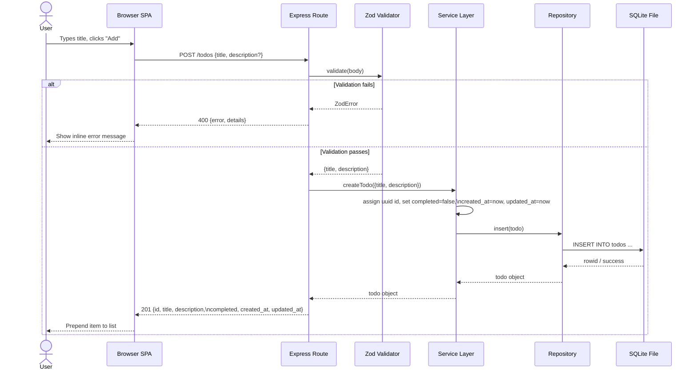
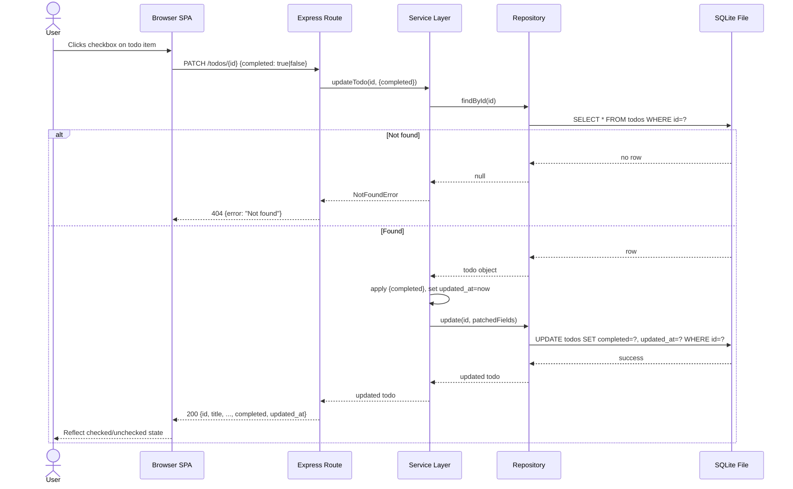
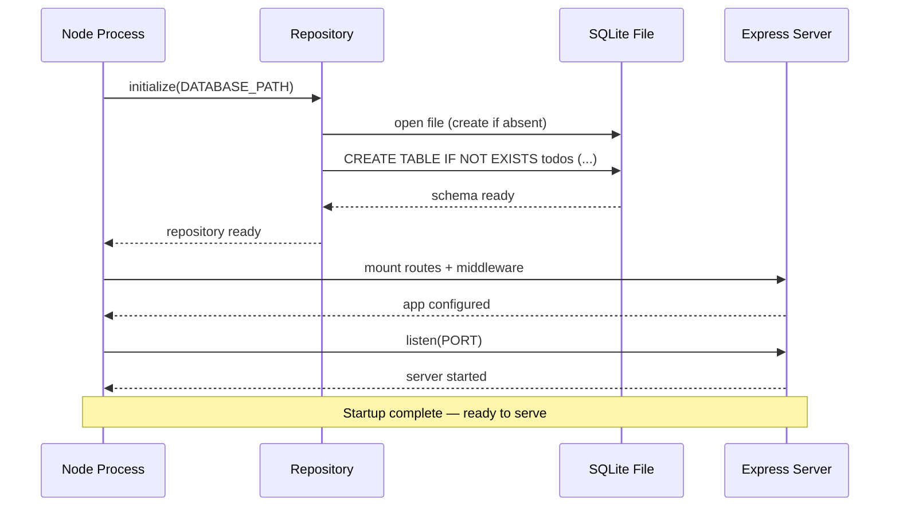
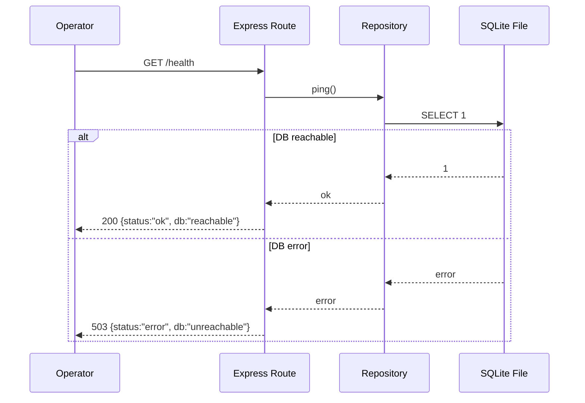

# System Design

## 1. Context

TodoApp runs as a **single Node.js process** on a local or self-hosted machine. All three concerns — REST API, business logic, and static-asset serving — live inside this one process. There are no external services required: persistence is provided by a single SQLite file on the local filesystem (`./data/todos.db` by default).

```
┌─────────────────────────────────────────────────────┐
│                   Node.js Process                   │
│                                                     │
│  ┌───────────┐   ┌────────────┐   ┌──────────────┐ │
│  │ Express   │   │  Service   │   │  Repository  │ │
│  │ Routes +  │──▶│  (domain   │──▶│  (better-    │ │
│  │ Validation│   │   logic)   │   │  sqlite3)    │ │
│  └───────────┘   └────────────┘   └──────┬───────┘ │
│        │                                 │         │
│  ┌─────▼──────┐                  ┌───────▼───────┐ │
│  │ Static SPA │                  │  todos.db     │ │
│  │ (HTML/JS/  │                  │  (SQLite file)│ │
│  │  CSS)      │                  └───────────────┘ │
│  └────────────┘                                    │
└─────────────────────────────────────────────────────┘
         ▲  fetch/JSON
┌────────┴────────┐
│  Browser (SPA)  │
└─────────────────┘
```

**Runtime configuration** (environment variables with defaults):

| Variable        | Default            | Purpose                          |
|-----------------|--------------------|----------------------------------|
| `PORT`          | `3000`             | TCP port Express listens on      |
| `DATABASE_PATH` | `./data/todos.db`  | SQLite file path                 |
| `LOG_LEVEL`     | `info`             | Stdout log verbosity             |

**Startup sequence:**
1. Load config from environment.
2. Repository opens / creates the SQLite file and runs schema migration (creates `todos` table if absent).
3. Express mounts routes, validation middleware, error handler, and static-file middleware.
4. Server begins listening on `PORT`.

---

## 2. Sequence flows

### 2.1 Full request lifecycle (Create Todo)



### 2.2 Toggle Complete



### 2.3 Application startup & DB initialization



### 2.4 Health check



---

## 3. Interfaces / APIs

### 3.1 REST API — base path `/todos`

All request/response bodies are `application/json`. Timestamps are ISO 8601 strings (UTC).

#### Todo object (canonical response shape)

```jsonc
{
  "id": "<uuid-v4>",
  "title": "Buy milk",          // required, 1–255 chars
  "description": "2% please",   // optional, 0–2000 chars, nullable
  "completed": false,
  "created_at": "2024-06-01T10:00:00.000Z",
  "updated_at": "2024-06-01T10:00:00.000Z"
}
```

#### Endpoints

| Method   | Path                  | Request body                        | Success                          | Error codes         |
|----------|-----------------------|-------------------------------------|----------------------------------|---------------------|
| `GET`    | `/todos`              | —                                   | `200` array of Todo objects      | `500`               |
| `POST`   | `/todos`              | `{title, description?}`             | `201` created Todo object        | `400`, `500`        |
| `PATCH`  | `/todos/:id`          | `{title?, description?, completed?}`| `200` updated Todo object        | `400`, `404`, `500` |
| `DELETE` | `/todos/:id`          | —                                   | `204` no body                    | `404`, `500`        |
| `GET`    | `/health`             | —                                   | `200 {status,db}`                | `503`               |

> **`PUT /todos/:id`** is not defined; `PATCH` handles both field edits and toggle-complete in a single endpoint. Clients send only the fields they wish to change.

#### Validation rules (enforced by zod)

| Field         | Rule                                                  |
|---------------|-------------------------------------------------------|
| `title`       | Required on `POST`; string; 1–255 chars               |
| `description` | Optional; string or null; ≤2000 chars                 |
| `completed`   | Optional; boolean                                     |
| `id` (path)   | Must be a valid UUID-v4; 404 if not found in DB       |

Client-supplied `id`, `created_at`, and `updated_at` in request bodies are **silently ignored**.

#### Error response shape

```jsonc
// 400 Validation error
{
  "error": "Validation failed",
  "details": [
    {"field": "title", "message": "String must contain at least 1 character(s)"}
  ]
}

// 404 Not found
{"error": "Todo not found"}

// 500 Internal error (no stack trace exposed)
{"error": "Internal server error"}

// 503 Health check failure
{"status": "error", "db": "unreachable"}
```

### 3.2 Static asset route

`GET /` (and any non-API path) → Express `static` middleware serves `public/index.html` and associated CSS/JS assets. The SPA uses `fetch` to call the JSON API on the same origin.

### 3.3 Internal component interfaces

#### Repository (`TodoRepository`)

```js
// All methods are synchronous (better-sqlite3)
repo.initialize()                    // opens DB, runs migrations
repo.ping()                          // SELECT 1 — throws if unreachable
repo.findAll()                       // → Todo[]
repo.findById(id: string)            // → Todo | null
repo.insert(todo: Todo)              // → Todo
repo.update(id: string, patch: Partial<Todo>) // → Todo | null
repo.delete(id: string)              // → boolean (true if row existed)
```

#### Service (`TodoService`)

```js
// Synchronous; throws typed errors (ValidationError, NotFoundError)
service.createTodo({title, description?})           // → Todo
service.listTodos()                                 // → Todo[]
service.updateTodo(id, {title?, description?, completed?}) // → Todo
service.deleteTodo(id)                              // → void
```

#### SQLite schema

```sql
CREATE TABLE IF NOT EXISTS todos (
  id          TEXT PRIMARY KEY,
  title       TEXT NOT NULL,
  description TEXT,
  completed   INTEGER NOT NULL DEFAULT 0,  -- 0=false, 1=true
  created_at  TEXT NOT NULL,
  updated_at  TEXT NOT NULL
);
```

---

## 4. Failure modes & resilience

| Failure                            | Detection                                      | Behavior / Mitigation                                                                                      |
|------------------------------------|------------------------------------------------|---------------------------------------------------------------------------------------------------------|
| **Invalid client input**           | Zod schema at route layer                      | `400` with structured `{error, details}`; request never reaches service or DB.                          |
| **Todo not found (by id)**         | `repo.findById()` returns `null`               | Service throws `NotFoundError`; route handler maps to `404`.                                            |
| **SQLite file missing/corrupt**    | `repo.initialize()` throws on startup          | Process exits immediately with a clear error message; operator must fix DB path or restore file.        |
| **SQLite locked (concurrent write)**| `better-sqlite3` throws `SQLITE_BUSY`          | Centralized error middleware catches, returns `500`. Acceptable: single-user low-concurrency workload.  |
| **DB unreachable at runtime**      | `repo.ping()` throws (e.g., disk full, unmount)| `GET /health` returns `503`. CRUD calls return `500` via error middleware.                              |
| **Disk full during write**         | `INSERT`/`UPDATE` throws `SQLITE_FULL`         | Returns `500`; no partial writes (SQLite's atomic transactions).                                        |
| **Malformed JSON body**            | Express `json()` parser error                  | Express emits `SyntaxError`; error middleware maps to `400 {error:"Malformed JSON"}`.                   |
| **Unknown route**                  | No matching Express handler                    | Returns `404 {error:"Not found"}` from catch-all handler.                                              |
| **Unexpected server-side error**   | Centralized error middleware (`app.use(errorHandler)`) | Returns `500 {error:"Internal server error"}`; full stack trace logged to stdout only.         |
| **Process crash / restart**        | OS or process supervisor restarts the process  | SQLite file persists; `repo.initialize()` re-runs migrations (idempotent); data fully restored.        |

**Resilience principles applied:**
- **Atomic writes:** `better-sqlite3` operations wrap each write in an implicit transaction; a crash mid-write leaves the DB consistent.
- **Idempotent migrations:** `CREATE TABLE IF NOT EXISTS` is safe to re-run on every startup.
- **Parameterized statements:** All SQL uses prepared statements; no risk of SQL injection from user data.
- **No silent swallowing:** Every unhandled error propagates to the centralized error middleware and is logged with a stack trace server-side.
- **Health check probes real readiness:** `SELECT 1` against the live DB handle, not just a process-alive ping.

---

## 5. Scaling considerations

This section records design constraints at v1 and the paths forward if requirements grow.

### 5.1 Current design point

- **Single process, single SQLite file:** Appropriate for a local single-user workload. `better-sqlite3` is synchronous and fast for small datasets; latency targets (<200 ms) are comfortably met locally.
- **No connection pooling needed:** One in-process SQLite handle; `better-sqlite3` handles the file lock internally.
- **No caching layer:** The full `todos` table is small; direct DB reads on every `GET /todos` is acceptable.

### 5.2 Concurrency limits

- SQLite supports many concurrent readers but **serializes writers**. Under high write concurrency the `SQLITE_BUSY` error rate rises. Mitigation: `better-sqlite3`'s synchronous model already queues calls within a single Node process; contention only arises with multiple processes or heavy parallel load.
- If concurrent usage grows, replace the repository's SQLite driver with a **Postgres** client (e.g., `pg` + connection pool) without touching routes or service — the repository boundary is designed for exactly this swap.

### 5.3 Horizontal scaling

- **Cannot run multiple instances against the same SQLite file** (file-lock contention, split-brain risk). Horizontal scale requires migrating to Postgres (or another network-accessible DB) and placing a load balancer in front of stateless Express instances.
- The `SERVICE → REPOSITORY` interface isolates all storage details; route and service code does not change.

### 5.4 Dataset growth

- `GET /todos` currently returns all rows. If the todo list grows large, add `limit`/`offset` query parameters at the route + repository layer without changing the service interface.
- Add an index on `created_at` if ordered list queries become slow: `CREATE INDEX idx_todos_created_at ON todos(created_at DESC);`

### 5.5 Authentication / multi-tenancy

- v1 is intentionally single-user with no auth. A future auth layer would be added as Express **middleware** before the route handlers; the service and repository would receive a `userId` context but their internal structure would not change.

### 5.6 Production hardening checklist (not in scope for v1)

- Swap SQLite → Postgres; use a connection pool (`pg-pool`).
- Add an HTTP reverse proxy (nginx / Caddy) in front of Express for TLS termination and static-asset caching.
- Run the Node process under a supervisor (systemd, PM2, or a container orchestrator).
- Add structured JSON logging (e.g., `pino`) and ship logs to an aggregation service.
- Set `NODE_ENV=production` to suppress stack traces and enable Express performance optimizations.
